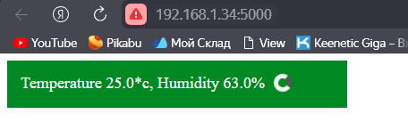
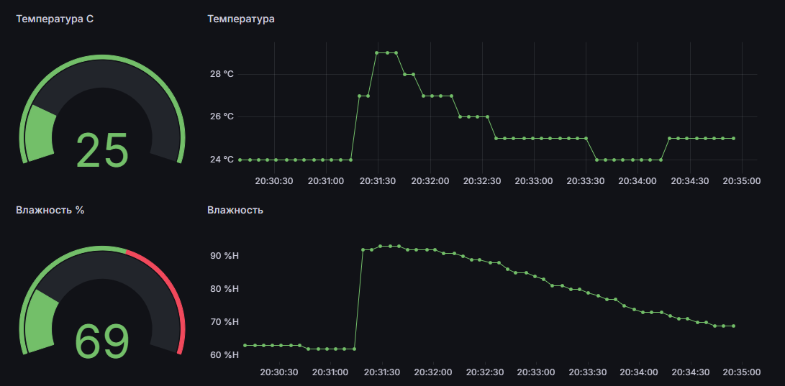

## Описание устройства

Устройство собрано на базе RaspberryPi 3 и датчика температуры DHT11. Имеет Web интерфейс для просмотра текущих показаний.

При нажатии кнопки "Save" новые значения запишутся в EEPROM. При перезапуске устройства, если введены корректные данные, то оно будет подключаться к сети WiFi, а также к MQTT брокеру.

Cхема передачи данных :

Показания температуры и влажности -> отправка по MQTT -> брокер Mosquitto -> Telegaf -> InfluxDB -> Grafana

## Отображение WEB интерфейса устройства

### Главная страница

* Показания текущей температуры

### Работа на сервере (Grafana)

